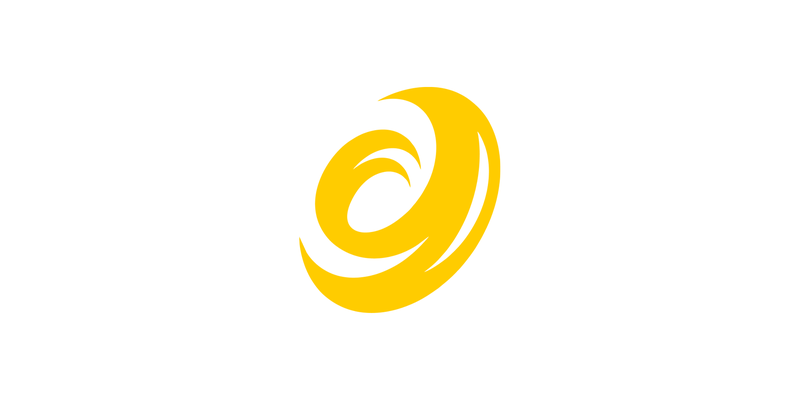
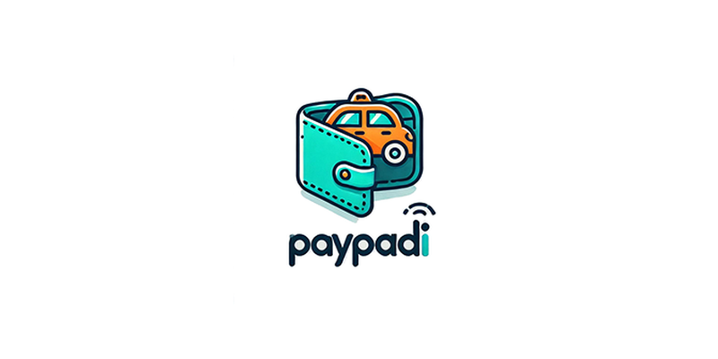
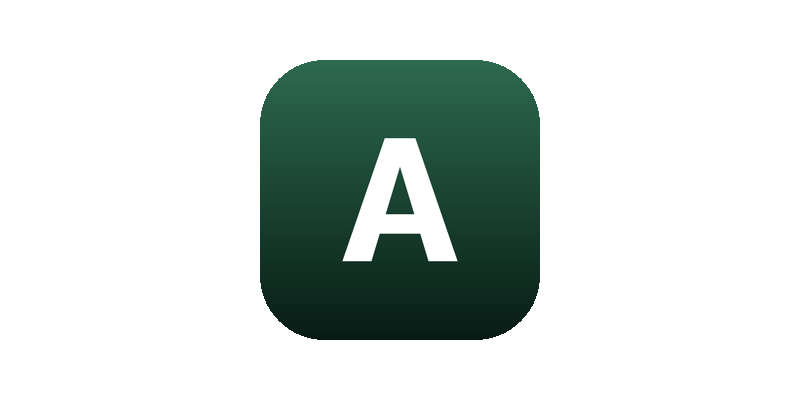
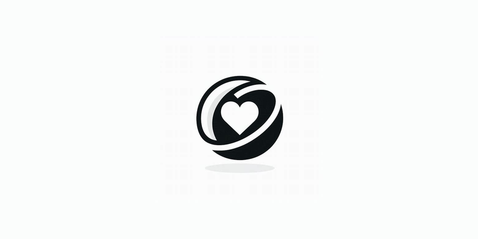
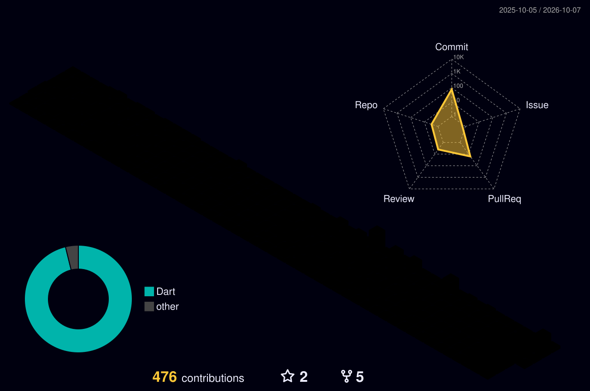
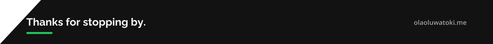

<!-- Banner -->

  

<!-- Social badges -->

  

  
  
  
  

---

## 👋 About me

<table>
  <tr>
    <td align="center" width="33%">📍 <b>Lagos, Nigeria</b></td>
    <td align="center" width="33%">💼 <b>Mobile Developer</b> 234Drive</td>
    <td align="center" width="33%">🎓 <b>B.Sc. Electrical &amp; Electronics Engineering</b> University of Lagos</td>
  </tr>
</table>

- 🚗 Building **Fortel** at 234Drive, a Flutter app for vehicle management and diagnostics with live data and 5,000+ fault codes over REST and WebSockets
- 🏗️ I enjoy the unglamorous parts: **clean architecture, CI/CD pipelines, crash monitoring** and making screens load faster
- 🚀 3+ years shipping Flutter apps across **fintech, automotive, healthtech and agritech**
- 🌱 Currently learning **React Native**
- 🤝 **Open to mobile engineering roles**. Reach me on [LinkedIn](https://linkedin.com/in/laolu-dev) or by [email](mailto:tokiolaoluwa01.dev@gmail.com)
- 💬 Ask me about **Flutter, BLoC vs Riverpod, Codemagic/Fastlane pipelines, Sentry**

---

## 🛠️ Tech stack

  
   
  

  
  
  
  
  
  
  
  

---

## 🚀 Featured work

<table>
  <tr>
    <td width="50%" valign="top">
      
      <h3>🚗 Fortel</h3>
      <b>234Drive</b> · in development
      
Cross-platform app for vehicle management and diagnostics: VIN lookup, document scanning, live data monitoring, system scans and 5,000+ trouble codes. Its CI/CD pipeline has shipped 16+ releases.

      

        
        
        
        
      

    </td>
    <td width="50%" valign="top">
      
      <h3>💸 PayPadi</h3>
      Fintech wallet
      
Wallet and payments app with user and driver onboarding, QR payments, transfers, beneficiaries and PDF receipts. It processed 500+ transactions in testing.

      

        
        
        
        
      

    </td>
  </tr>
  <tr>
    <td width="50%" valign="top">
      
      <h3>🌾 AgSol</h3>
      AI precision agriculture
      
A responsive Flutter Web platform with 20+ screens: farm boundary uploads (SHP, GeoJSON, KML), map-based parcel dashboards, and AI crop classification, health monitoring and yield forecasting.

      

        
        
        
      

    </td>
    <td width="50%" valign="top">
      
      <h3>🩺 Ellipsis Care</h3>
      Voice health assistant
      
A health assistant with 40+ screens used by 65+ beta users. It answers health questions by voice with AI-generated audio, sends medication and meal reminders, and has a Twilio SOS alert.

      

        
        
        
        
      

    </td>
  </tr>
  <tr>
    <td colspan="2" valign="top">
      
      <h3>📅 <a href="https://github.com/laolu-dev/dialink">Dialink</a></h3>
      Medical appointment booking
      
A full-stack appointment booking app with a Flutter client and a Node.js/Express + MongoDB backend. It stores sensitive data encrypted, following HIPAA/GDPR principles.

      

        
        
        
      

    </td>
  </tr>
</table>

---

## 💼 Experience

| Role | Company | When |
| --- | --- | --- |
| 📱 Mobile Developer | **234Drive Limited** | May 2026 – Present |
| 📱 Mobile Developer | **AutoMotion Technologies** | Nov 2024 – Apr 2025 |
| 💙 Flutter Developer | **Sigil Inc** | Aug 2023 – Jun 2024 |

---

## 📊 GitHub stats

  

  

  <picture>
    <source media="(prefers-color-scheme: dark)" srcset="./dist/github-snake-dark.svg" />
    <source media="(prefers-color-scheme: light)" srcset="./dist/github-snake.svg" />
    
  </picture>

